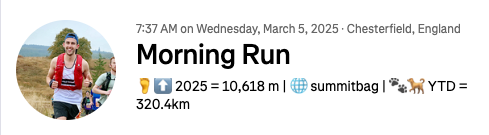

# Avec Chien (With Dog) 🐕

A noddy node app to hit the Strava API and count the miles done with my dog. Every run that has a 🐾 (paw emoji) in the description gets the mileage of that run added to a total. It then updates the description of the run with the current total. Works in a similar way to Summitbag, which sums up your total elevation for the year. Planned to run this in AWS on a Lambda and poll Strava for latest activities but never go round to it. 

